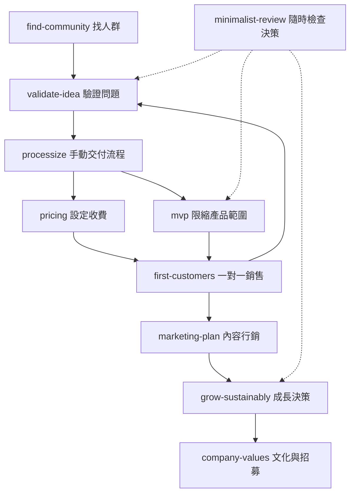

# Skill 架構導讀與審閱工作表

> 本頁為編者分析，不是原文翻譯。來源固定於 `eb9f57fba03ddb0382ed3bfe6654d3d7df128c70`。請搭配 [中英對照入口](../README.zh-TW.md) 閱讀。

## 1. 先看全貌

這是由提示指引組成的創業顧問插件：市集設定告訴工具去哪裡找插件，插件設定描述套件，10 個 Markdown 檔則規定 AI 在各種創業情境下如何對話與交付。

原始檔案共 13 個：1 個 README、2 個 JSON、10 個 SKILL.md。基準版本沒有腳本、測試、資料庫、外部服務連線或額外資源檔。

```text
專案根目錄
├── README.md                         原始使用說明
├── .claude-plugin/
│   ├── marketplace.json             市集列出插件，source 指向 ./
│   └── plugin.json                  名稱、版本、作者、來源、授權宣告
├── skills/
│   ├── find-community/SKILL.md
│   ├── validate-idea/SKILL.md
│   ├── mvp/SKILL.md
│   ├── processize/SKILL.md
│   ├── first-customers/SKILL.md
│   ├── pricing/SKILL.md
│   ├── marketing-plan/SKILL.md
│   ├── grow-sustainably/SKILL.md
│   ├── company-values/SKILL.md
│   └── minimalist-review/SKILL.md
├── README.zh-TW.md                   本次新增：中文入口
└── zh-TW/                           本次新增：翻譯、設定說明與審閱
```

## 2. 一個 SKILL.md 的內部結構

| 層次 | 檔案中的內容 | 作用 | 審閱時應追問 |
|---|---|---|---|
| 前置資料 | YAML 的 `name`、`description` | 識別 Skill，描述何時使用 | 觸發條件會不會與別的 Skill 重疊？ |
| 輸入提示 | 僅 minimalist-review 有 `argument-hint` | 提醒使用者描述決策或情境 | 其他 Skill 是否也需要明確輸入範例？ |
| 角色 | 一致的商業顧問定位與書籍理念 | 限定判斷視角 | 是合適的觀點，還是過度單一的偏見？ |
| 核心原則 | 各檔案的一項主要信念 | 給 AI 決策優先順序 | 原則適用條件有沒有寫清楚？ |
| 工作框架 | 問題、步驟、判準、例子 | 引導推理與對話 | 沒資料時，會追問還是自行補完？ |
| 防錯提醒 | 部分檔案的反模式或警訊 | 避免過度開發等常見錯誤 | 是否誤把特殊情境一律否決？ |
| 產出 | 每個檔案的 Output | 定義回答該包含什麼 | 只是文字清單，還是可驗收的結果？ |

`description` 描述觸發情境，但不是可執行的程式條件。`Output` 是自然語言要求，也沒有 JSON schema 驗證。這些區塊能提高回答一致性，並不保證每次都遵守。

## 3. Skills 的關係

以下是編者依用途整理的閱讀／工作路徑，不是專案內建的自動排程。定價、銷售、驗證常需來回進行。



原 README 把 MVP 列在 processize 前；此圖依「先手動交付再產品化」的工作邏輯呈現，不改動原文件順序。`processize` 明確提到必要時回到 `/find-community`，但其他轉場多為語意上的關係，沒有程式自動呼叫或狀態交接。

## 4. 逐項 review

| Skill | 架構價值 | 主要缺口 | 建議審閱問題 |
|---|---|---|---|
| find-community | 先收斂人群，再找需求 | 沒有證據欄與候選評分尺度 | 所列社群是使用者提供，還是 AI 猜的？ |
| validate-idea | 提供明確結論與下一步 | 口頭意願和實付混在一起；沒有信心等級 | 哪筆證據足以讓結論從待驗證變成已驗證？ |
| mvp | 將手動、流程化、產品化分開 | 週末交付偏好可能不適合所有領域 | 最小版本是否仍滿足必要品質與交付條件？ |
| processize | 要求清楚的輸入、步驟、時間、輸出 | 缺少例外處理、驗收條件與責任人 | 遇到資料缺漏或返工時，流程怎麼走？ |
| first-customers | 有接觸順序、訊息與追蹤目標 | 親友購買可能有支持偏誤；名單可能被 AI 虛構 | 客戶真有需求，還是因人情購買？ |
| pricing | 同時考慮成本與價值 | 毛利率與加價率不夠明確；收入不等於所得 | 價格是否包含自己的交付工時與流失假設？ |
| marketing-plan | 內容、平台、郵件名單有明確產出 | 把客戶數及漏斗路徑寫得過度固定 | 哪些訊號才表示可以擴大，而非只看人數？ |
| grow-sustainably | 把金錢、精力與可逆性一起評估 | 獲利不等於永遠安全；沒有現金流模型 | 收入延遲或大客戶離開時，能承受多久？ |
| company-values | 要求故事與行為，超越空泛口號 | Gumroad 範例未必適合每種組織 | 哪些價值觀是自己的選擇，而非照抄？ |
| minimalist-review | 可跨情境套用的檢查表 | 缺少準則衝突時的權重與決策紀錄 | 簡單、獲利與客戶需求衝突時，以何者優先？ |

## 5. 共通缺口與改善優先序

### 優先：讓事實與假設分開

原 Skill 經常要求具體客戶名單與明確結論，但沒有共用的「禁止虛構、缺資料就標記」規則。若要改造成自己的版本，可要求輸出分成：已確認事實、使用者陳述、假設、待蒐集證據。具體人物名單必須由可追溯輸入支持。

### 其次：讓各 Skill 共用同一份事業摘要

目前每份檔案都能獨立使用，但沒有共享狀態。使用者可能在不同 Skill 中反覆描述同一件事，AI 也可能產生矛盾價格或客群。可另設一份簡短事業摘要，記錄目標客群、核心問題、報價、手動流程版本、最近驗證結果。這是改進建議，本次沒有建立或填入私人事業資料。

### 再來：建立可驗收的輸出

Output 清單可再補上完成標準。例如 SOP 不只列步驟，還需說明輸入不完整時的做法、完成條件、工時上限與返工處理。驗證報告不只寫「已驗證」，還應連到實際訪談與付款證據。

### 最後：明確定義工具與操作邊界

目前文件沒有工具整合。產出開發信不等於寄出、列名單不等於取得聯絡資料、算價格不等於建立收款頁。若日後加入工具，應在對應 Skill 說明哪些動作只是草稿、哪些動作會真的寫入系統或對外聯絡。

## 6. 特別值得核對的內容

- `validate-idea`：詢問 10 人、3 人願意付款是作者給的啟發式門檻，不是通用的市場驗證標準。
- `processize`：「免費使用者提供零訊號」過度絕對；免費使用行為仍可提供需求與體驗資訊，只是不能直接證明付費意願。
- `first-customers`：「早期 99% 人工銷售、後期 99% 口碑」應當作作者強調方向的敘述；文件未提供計算方法。
- `pricing`：售價為成本兩倍時，毛利率為 50%，但加價率為 100%。實際建模時兩者需明確區分。
- `pricing`：每月 10 美元乘以 200 位客戶是 2,000 美元營收，尚未扣成本，不能直接視為可支配所得。
- `marketing-plan`：約 100 位客戶不會自動等於產品市場契合；應補看留存、重複購買與需求穩定性。
- `grow-sustainably`：獲利並不保證現金流安全或永遠存活，仍取決於付款時點、負債與未來需求。
- `mvp` 及其他檔案列出的平台費率、服務與歷史案例，翻譯未更新；若真要採用，應另外查證。

## 7. 你的審閱工作表

每個 Skill 可複製下表記錄：

| 欄位 | 你的筆記 |
|---|---|
| Skill 名稱 | |
| 我希望它處理的情境 | |
| 最低必要輸入 | |
| 我認同的原則 | |
| 我不同意或需加條件的原則 | |
| 應保留的輸出 | |
| 缺少的證據或驗收標準 | |
| 是否需要外部工具 | |
| 哪些動作應先保留為草稿 | |
| 結論：保留／修改／合併／不用 | |

整體檢查：

- [ ] 已讀懂兩個 JSON 與 SKILL.md 的角色差異。
- [ ] 已逐一對照 10 個中英文檔案。
- [ ] 已區分作者主張與編者評論。
- [ ] 已辨識 validate-idea、mvp、processize 的範圍重疊。
- [ ] 已找出需要真實證據才能回答的問題。
- [ ] 已確認這套文件沒有自動經營、持久化狀態或外部工具實作。
- [ ] 已決定哪些內容適合自己的情境，再考慮改寫或安裝。

## 8. 此次驗證範圍

本次檢查涵蓋來源完整性、中英文段落結構與清單項目數、相對連結及 GitHub 寫入結果。這些檢查能偵測漏檔與明顯結構缺漏，不能替代人工語言審校。沒有執行 Claude Code 安裝，也沒有測試模型實際遵循各 Skill 的效果。
